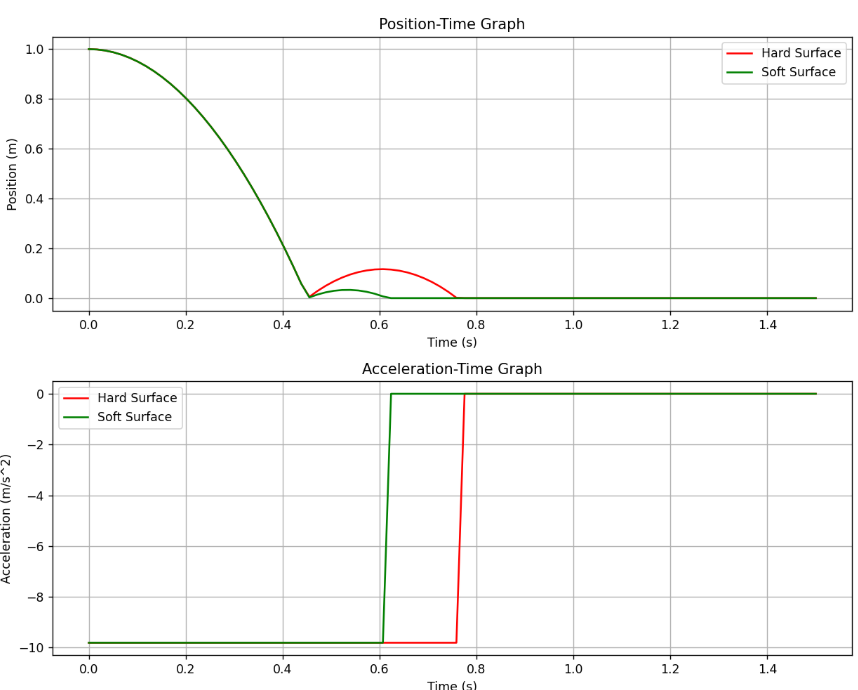

# Week10 Report

## 1. Tracker를 이용한 낙하 운동 분석

### 위치-시간 그래프

아래 그래프는 단단한 바닥(Hard Surface)과 완충재가 있는 부드러운 바닥(Soft Surface)에서 물체의 위치 변화 과정을 나타낸다.



### 분석

- 두 경우 모두 같은 초기 높이에서 자유낙하를 시작하였다.
- 충돌 전까지는 거의 동일한 낙하 궤적을 보인다.
- 충돌 이후 단단한 바닥에서는 더 높은 반발 높이가 나타났다.
- 반면 완충재가 있는 부드러운 바닥에서는 충격 에너지의 일부가 흡수되어 반발 높이가 더 낮게 나타났다.

---

## 2. 반발 계수(e) 계산

### 계산식

반발 계수는 충돌 전후 속도의 비를 이용하여 계산하였다.

\[
e = \frac{v_2}{v_1}
\]

여기서,

- \(v_1\): 충돌 직전 속도
- \(v_2\): 충돌 직후 반발 속도

낙하 속도는 다음 식을 이용하여 계산하였다.

\[
v_1 = \sqrt{2gh}
\]

사용한 Python 코드 일부는 다음과 같다.

```python
# Calculate rebound coefficients and rebound velocities
v1 = -np.sqrt(2 * g * drop_height)
v2_hard = abs(v1) * e_hard
v2_soft = abs(v1) * e_soft
```

---

### 결과표

| 표면 종류 | 반발 계수 (e) |
|---|---|
| Hard Surface | 0.340909 |
| Soft Surface | 0.181818 |

### 결과 해석

- 단단한 바닥의 반발 계수가 더 크게 측정되었다.
- 이는 충돌 과정에서 에너지 손실이 상대적으로 적었음을 의미한다.
- 반면 완충재가 있는 부드러운 바닥은 충격 에너지를 더 많이 흡수하여 반발 계수가 낮게 나타났다.

---

## 3. 가장 효율적인 포장재 구조 분석

### 서론

포장재는 물품을 안전하게 보호하는 데 중요한 역할을 한다. 다양한 포장재 중에서 벌집 구조의 골판지는 가장 효율적인 구조 중 하나로 평가된다. 본 리포트에서는 벌집 구조 골판지의 효율성을 공학적인 관점에서 분석하였다.

---

### 공학적 분석

#### 1. 강도와 내구성

벌집 구조는 자연에서 영감을 받은 구조이다. 육각형 패턴은 외부 힘을 균등하게 분산시켜 높은 압축 하중을 견딜 수 있도록 만든다.

#### 2. 가벼운 무게

벌집 구조는 높은 강도를 유지하면서도 매우 가볍다. 따라서 운송 비용을 절감할 수 있으며 탄소 배출 감소에도 도움이 된다.

#### 3. 충격 흡수 능력

벌집 내부의 공기층은 외부 충격을 효과적으로 흡수한다. 이로 인해 물품 손상을 최소화할 수 있으며 포장 효율이 높아진다.

#### 4. 친환경성

벌집 골판지는 주로 재활용 종이로 제작된다. 또한 생분해가 가능하고 재활용성이 높아 환경 친화적인 포장재로 평가된다.

---

### 결론

벌집 구조 골판지는 강도, 경량성, 충격 흡수 능력, 친환경성을 모두 갖춘 효율적인 포장재이다. 이러한 특성은 물품 보호뿐 아니라 비용 절감과 환경 보호에도 기여한다.

---